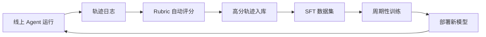

# 08 Rubric评测与Agentic-RL训练闭环

**本章课程目标：**  
- 理解为什么"评测体系是 Agent 项目的命门"——没有 Rubric 就没有 reward，没有 reward 就没有训练。  
- 掌握 Rubrics as Rewards（RaR）思路：对每条 query 动态生成专属评分细则，分 P0/P1/P2 三档。  
- 理解 SFT 冷启动 + Agentic RL 天花板的两阶段训练范式，以及它们解决了什么问题。  

**学习建议：** 这一章是整个 Globex 工程基础设施层的"压轴"——它决定了项目能不能持续进化。如果你只能记住一件事：**没有评测体系，所有"优化"都只是在赌。** 有了评测，你才敢做训练，才有"持续进化"四个字。  

---  

## 1、本章导读  

### 1.1 一个项目启动时几乎没人重视的事  

Globex 项目第一版完全靠 prompt engineering 调出来的：写 system prompt、调工具描述、改 Few-Shot 示例。  

每天的工作就是修 bad case：  
```text  
今天：用户搜"出差带啥"返回杂货 → 改 system prompt  
明天：用户搜"礼物"返回情侣款 → 加判断规则  
后天：闭源模型升级了，整体效果抖动 → 整段 prompt 失效，重头调  
```  

最致命的是最后一条：**模型版本一升级，线上抖动一天，团队完全被动**——既不知道哪儿坏了、也不敢动。  

### 1.2 这种状态下你是在打地鼠...  

修 A case 又冒出 B case，永远没有"系统性变好"的时刻。这不是优化方法的问题，是**没有评测体系**的问题：  
- 没有评测，你不知道哪些 case 修好了、哪些没有。  
- 没有评测，你不知道这次改 prompt 是变好了还是变坏了。  
- 没有评测，你不敢做训练——因为没有 reward 信号。  

本章讲的就是怎么从"打地鼠"升级到"数据驱动"。  

---  

## 2、Rubrics as Rewards：核心思路  

### 2.1 不再问"这个回答好不好"  

传统评测的问法："这个回答好不好？给个 1-10 分。"  

这种问法的问题是太抽象。同一条回答，不同评测人可能给 5 分到 8 分不等，且无法定位"为什么不是 9 分"。  

### 2.2 改问"针对这个特定的需求，回答是否满足以下关键维度"  

Rubrics as Rewards（RaR）的思路：**为每一条 query 动态生成专属的评分细则**，再根据细则逐项打分。  

例：用户 query 是"送给粉丝的礼物预算 100 以内 给男生 28 岁 喜欢看美女 想找女朋友 会喝酒 想要送可爱帅气的礼物 有趣 不要玩具"  

针对这条 query，系统调用强模型动态生成的 Rubric：  

| 类别  | 维度  | 判定描述  | 权重  |  
|-------|-------|-------------|-------|  
| P0  | 负向约束与人群匹配  | 推了玩具/女士/儿童用品 → 直接判 fail  | Essential（一票否决）  |  
| P0  | 价格与业务逻辑  | 主体商品单价 > 100 元 → 直接判 fail  | Essential（一票否决）  |  
| P1  | 组件调用合理性  | 必须包含多个 query 楼层 + 推荐理由 + 商品卡片  | Important（fail 扣 2 分）  |  
| P1  | Query 拆解合理性  | 必须是具体词，覆盖喝酒/脱单/有趣方向  | Important（fail 扣 2 分）  |  
| P2  | 需求覆盖度  | 5 分：完美覆盖；3 分：部分覆盖；1 分：泛泛  | Scored（1-5）  |  
| P2  | 场景洞察力  | 5 分：体现"粉丝礼物"视角；1 分：纯 C 端话术  | Scored（1-5）  |  
| P2  | 决策建议价值  | 5 分：组合策略 + 材质对比；1 分：无实质建议  | Scored（1-5）  |  

注意两点：  
1. **Rubric 是针对这条 query 动态生成的**——换一条 query（"工业级螺丝批量采购"），Rubric 完全不同。  
2. **三档结构**：P0 红线一票否决、P1 规范扣分、P2 质量打分。  

---  

## 3、三档评分细则  

### 3.1 P0：业务红线  

| 例子  | 触发条件  |  
|-------|-------------|  
| 推了违禁品  | 商品命中违禁词库  |  
| 价格远超用户预算  | 主体商品 > 1.5 倍预算  |  
| 泄露内部 ID 或工具名  | 输出里出现 `item&#95;id` 等  |  
| 把女士用品推给男性用户的礼物场景  | 类目和性别冲突  |  

P0 项是"一票否决"——只要任意一项 fail，整体直接判 fail，无论 P1/P2 拿了多少分。  

### 3.2 P1：执行规范  

| 例子  | 触发条件  |  
|-------|-------------|  
| Summary 模块完整性  | ShoppingSummary 必须存在  |  
| 工具调用顺序  | WideSearch 必须包含 CategoryInsight  |  
| Markdown 结构  | 商品卡片必须有标题/价格/理由  |  
| 效率约束  | 不能死循环（同工具 5 次以上）  |  

P1 项每违反一项扣 2 分。  

### 3.3 P2：质量打分  

| 维度  | 1 分  | 5 分  |  
|-------|------|------|  
| 需求覆盖度  | 泛泛推荐  | 完美覆盖用户所有显式 + 隐式需求  |  
| 场景洞察力  | 纯 C 端话术  | 体现专业视角（如 B2B 视角、礼物场景视角）  |  
| 决策建议价值  | 无实质建议  | 提供组合策略 / 对比分析 / 材质建议  |  

P2 项是 1-5 分的打分制。  

---  

## 4、自动化评测流程  

### 4.1 完整流程  
```text  
1. 用户 query 进入  
2. 调强模型（如 GPT-5 / Qwen-Max）→ 动态生成 Rubric  
3. Globex Agent 执行 → 产出回答  
4. 调 judge 模型（带 Rubric + Agent 回答）→ 逐项打分  
5. 计算总分 = α × P0 + β × Σ P1 + γ × Σ P2  
6. 入库（query, agent 回答, Rubric, 分数）→ 评测数据集  
```  

### 4.2 一致性验证  

自动化 Rubric 评分和资深运营人工打标的一致性 **可达 90%+**——意味着可以放心用自动 judge 替代大部分人工评测，效率提升一个数量级。  

---  

## 5、SFT 冷启动：让模型先学会范式  

### 5.1 为什么需要 SFT  

如果直接对一个开源基座（如 Qwen3.5-35B-A3B）跑 Agentic RL，**奖励太稀疏**——模型一开始连 AgentLoop 范式都不会，工具调用格式都错，根本拿不到正向 reward 信号。  

SFT（监督微调）的作用是让模型先学会"基本范式"：  
- 什么时候该 Think  
- 什么时候该调 ItemSearch  
- 什么时候该收尾给 ShoppingSummary  
- 工具调用的 JSON 格式  
- 多轮循环的节奏  

### 5.2 SFT 数据从哪来  

**RaR 高分轨迹自动入库**：  
```text  
评测系统每天跑大量 query  
  → judge 给出分数  
  → 分数 >= 阈值（如 70）的轨迹自动进入 SFT 训练集  
  → 周期性微调基座  
```  

这是一条**自动化的数据飞轮**——评测越多，高分数据越多，SFT 后的模型越强，再产出更高分轨迹。  

### 5.3 SFT 的训练记录  

实测：Qwen3.5-35B-A3B 基座经过 SFT 后，loss 从 1.2 快速降到 0.6 并稳定收敛，没有过拟合。  

这说明：**SFT 数据集（RaR 高分轨迹）信息密度高、噪声低**，模型能高效"内化"领域知识。  

---  

## 6、Agentic RL：把天花板再推一层  

### 6.1 RL 在哪一步介入  
```text  
Qwen3.5-35B-A3B 基座  
  → SFT 冷启动（学会 AgentLoop 范式）→ 评测分显著回升  
  → Agentic RL（天花板优化）→ 评测分超越同尺寸闭源大模型  
```  

SFT 解决"会不会"的问题，RL 解决"做得好不好"的问题。  

### 6.2 reward 函数的五个维度  

| reward 维度  | 关注点  | 关键校验  |  
|--------------|----------|-------------|  
| 响应质量奖励  | 终极目标——最终回答的专业度  | 直接映射 RaR 评测分数  |  
| 过程合规奖励  | 推理范式正确——避免无效探索  | 工具调用顺序、终结工具校验、效率约束  |  
| Query 拆解奖励  | 中间步骤——搜索词精准度  | 评估生成的搜索词是否具体、是否覆盖多需求  |  
| 商品相关性奖励  | 结果匹配度——召回的商品满足约束  | 价格、属性是否符合 query 要求  |  
| 格式与安全奖励  | 系统安全——防止泄露内部数据  | 一票否决：泄露 item_id / 工具名  |  

最终 reward = 五维归一化后加权求和。  

### 6.3 算法选型  

Globex 用 **GSPO**（Group Sequence Policy Optimization）这类序列级算法：  

| 维度  | Token 级算法（如标准 PPO）  | 序列级算法（GSPO）  |  
|-------|-----------------------------------|--------------------------|  
| 重要性比率  | 单 token 概率比  | 整个序列的几何平均比率  |  
| 方差  | 长序列下方差大、训练不稳定  | 平滑后稳定  |  
| MoE 友好性  | 专家路径切换会震荡  | 只要序列连贯，对 MoE 友好  |  

### 6.4 训练后的核心收益  

不只是评测分从基座水平一路拉到超越同尺寸闭源模型，更重要的是：  
- **行为可控**：不再因为厂商版本升级而抖动一整天。  
- **新版本可发布**：badcase 想修就能定向修，不再靠 prompt 救。  
- **超越同尺寸闭源大模型**：在 B2C 复杂购物链路上，专用 RL 模型可观地超过通用闭源模型。  

---  

## 7、数据飞轮：闭环起来才有威力  

### 7.1 完整闭环  



### 7.2 飞轮的几个关键点  

| 关键点  | 为什么重要  |  
|----------|----------------|  
| 自动评分  | 没有自动 judge，人工抽样跟不上线上数据增长  |  
| Rubric 动态化  | 不同 query 用不同细则，避免"通用模板"打分失真  |  
| 高分阈值  | 只用高质量数据训练，避免"以错训错"  |  
| 周期性发布  | 模型行为持续微调，跟随业务演进  |  

### 7.3 飞轮和厂商升级的关系  

通用闭源大模型（如 GPT-5、Claude Opus）会持续升级，但你**用不上它的训练数据飞轮**——它的数据飞轮是为通用任务优化的，不会专门优化你的电商场景。  

Globex 的数据飞轮是**领域专属**的——它学的是 B2C 跨境购物的对话节奏、Rubric 红线、用户偏好分布。这套领域知识是通用模型学不到的。  

---  

## 8、和前面章节的关系  

| 章节  | 为本章贡献了什么  |  
|-------|-------------------------|  
| 第 1-3 章  | AgentLoop 范式 + fork 策略 → RL 训练的 action space  |  
| 第 4 章  | 三塔召回 → ItemSearch 工具的输出质量影响 reward  |  
| 第 5 章  | Cache Breakpoint → 训练时的 prompt 结构和线上一致  |  
| 第 6 章  | 长期记忆 → 用户偏好作为训练时的额外 context  |  
| 第 7 章  | AGUI 事件流 → 训练时记录每一步事件，用于 reward 拆解  |  

每一章的工程能力都给评测训练闭环贡献了一块拼图。**没有前面 7 章，第 8 章没法落地；没有第 8 章，前面 7 章不能持续进化。**  

---  

**本章小结：**  

到这里，你应该能完整理解 Globex 的评测训练闭环：  
1. 评测体系是 Agent 项目的命门——没有 Rubric 就没有 reward，没有 reward 就只能靠 prompt 修 bad case 修到天荒地老。  
2. Rubrics as Rewards 思路：对每条 query 动态生成专属评分细则，分 P0 红线 / P1 规范 / P2 质量三档。  
3. 自动 judge 与人工打标一致性 90%+，可以替代大部分人工评测。  
4. 两阶段训练：SFT 冷启动让模型学会 AgentLoop 范式，Agentic RL 把质量推到天花板。  
5. 数据飞轮一旦闭环（线上 → 评测 → SFT → RL → 部署），模型行为可控，不再被厂商版本升级牵着走。  

到此，第 1-8 章的能力铺垫全部完成。下一章「[Globex 项目总览与工程初始化]」开始正式进入项目主线，把前面 8 章的所有能力放进一个真实的全球电商购物 Agent 项目里。
