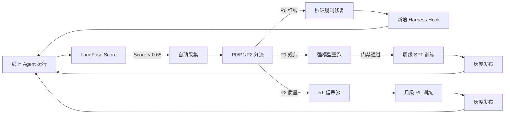

# 18-2 Bad-Case 驱动的数据飞轮

**本章课程目标：**
- 掌握 bad case 从“线上出现”到“变成训练信号”的完整自动化管线。
- 理解 P0/P1/P2 三级分流策略——不同严重度的 bad case 走不同进化路径、不同速度修复。
- 掌握飞轮的三个周期：日级（P0 自动规则修复）/ 周级（P1 进 SFT 训练集）/ 月级（P2 进 RL reward 信号）。
- 理解“以错训错”的风险和三道门禁。
- 看清本章和 08-1/08-2（怎么训）的关系：那两章讲训练本身，本章讲训练数据从哪来、怎么持续流入。

**学习建议：**  
这一章是自进化系列里最“重”的一条路径——改模型。但它的前提是“改记忆和改 Prompt 都解决不了”（见 18-1 §4 决策流程）。如果你只改得了记忆和 Prompt，这一章可以先跳；但如果你的 Agent 的决策质量有天花板，这一章就是“推天花板”的持续供给通道。

**对应代码分支：** `18-2-bad-case-flywheel`

---

## 1、数据飞轮解决什么问题

### 1.1 不自动化的痛苦

第 8 章已经讲了评测训练闭环的概念——Rubric 评测 → SFT 冷启动 → Agentic RL。但那一版闭环有一个巨大的瓶颈：**训练数据靠人工攒**。

```text
08-1 章的 SFT 数据来源：
  一档：RaR 高分轨迹自动入库 → 需要线上跑量才有
  二档：强模型蒸馏 → 需要人工挑 query 去跑
  三档：人工构造示范 → 需要运营手动做

问题：
  → 二档三档全靠人工驱动
  → 线上每天 bad case 在增长，但没有自动管线把它们变成训练数据
  → 人工挑 query → 人工跑蒸馏 → 人工审核 → 入库 → 等下次训练周期
  → 从发现 bad case 到修复可能要 2-4 周
```

### 1.2 数据飞轮 = bad case 自动变成训练信号

```text
飞轮自动化后：
  线上 bad case 出现（LangFuse Score < 阈值）
    → 自动采集完整轨迹
    → 自动按 P0/P1/P2 分级
    → P0：秒级自动生成规则修复
    → P1：周级自动进 SFT 训练集
    → P2：月级自动进 RL reward 池
    → 无人干预，持续转动
```

---

## 2、Bad Case 自动采集管线

### 2.1 采集触发条件

```python
# app/evolution/collector.py
from app.observability.trace_ctx import get_langfuse_trace

COLLECTION_THRESHOLD = 0.65  # Rubric 分 < 这个值视为 bad case


async def should_collect(trace_id: str, rubric_score: float) -> bool:
    """判断是否采集为 bad case。"""
    if rubric_score >= COLLECTION_THRESHOLD:
        return False  # 不是 bad case
    return True
```

### 2.2 采集什么

每条 bad case 采集完整的“诊断包”：

| 字段 | 内容 | 用途 |
|---|---|---|
| `trace_id` | LangFuse Trace ID | 溯源 |
| `query` | 用户原始 query | 复现 |
| `trajectory` | 完整的 messages 列表 | SFT 负样本 / RL 低分样本 |
| `rubric_score` | 总分 + P0/P1/P2 各项明细 | 分级分流 |
| `rubric_comment` | judge 的扣分原因 | 定位根因 |
| `tool_calls` | 所有工具调用的名称 + 参数 + 返回摘要 | 工具维度分析 |
| `token_consumed` | 总 token 消耗 | 成本维度 |
| `timestamp` | 采集时间 | 去重 + 时效性 |

### 2.3 去重策略

同一类 query 不要采太多重复样本：

```python
# app/evolution/dedup.py
import hashlib
from collections import defaultdict

# 按 query pattern 去重：同一 pattern 每天最多保留 3 条
_daily_counts: dict[str, int] = defaultdict(int)
MAX_PER_PATTERN_PER_DAY = 3


def should_keep(query: str) -> bool:
    """同一 pattern 每天最多采集 3 条。"""
    # 简化 pattern：去掉数字和标点，取前 20 字
    pattern = hashlib.md5(query[:20].encode()).hexdigest()[:8]
    _daily_counts[pattern] += 1
    return _daily_counts[pattern] <= MAX_PER_PATTERN_PER_DAY
```

**为什么去重：** 同一类 query 的 bad case 重复 50 条进训练集没有增量——反而会让模型过拟合到这一类问题上。每类保留 3 条代表性样本就够。

---

## 3、P0/P1/P2 三级分流

### 3.1 分流逻辑

```python
# app/evolution/router.py
from dataclasses import dataclass
from enum import Enum


class CaseSeverity(Enum):
    P0 = "p0"  # 红线违规：泄露/违禁/严重格式错误
    P1 = "p1"  # 规范违反：工具顺序错/格式不完整/循环
    P2 = "p2"  # 质量不足：覆盖不全/洞察不深/推荐不准


@dataclass
class RoutedCase:
    severity: CaseSeverity
    trace_id: str
    query: str
    trajectory: list[dict]
    rubric_detail: dict
    repair_suggestion: str | None = None


def route_bad_case(rubric_detail: dict) -> CaseSeverity:
    """根据 Rubric 扣分明细判断严重等级。"""
    # P0：任何红线项 fail
    if rubric_detail.get("p0_pass") is False:
        return CaseSeverity.P0

    # P1：规范项扣分 >= 4 分
    p1_deductions = rubric_detail.get("p1_total_deduction", 0)
    if p1_deductions >= 4:
        return CaseSeverity.P1

    # P2：质量项均分 < 3.0（满分 5）
    p2_avg = rubric_detail.get("p2_average", 5.0)
    if p2_avg < 3.0:
        return CaseSeverity.P2

    return CaseSeverity.P2  # 兜底
```

### 3.2 三级各走什么路径

| 级别 | 典型 bad case | 进化路径 | 生效速度 |
|---|---|---|---|
| P0 | 输出泄露 item_id / 推了违禁品 | 自动生成 Harness Hook 规则 | 秒级 |
| P1 | 不调 ShoppingSummary 就回答 / 格式错误 | 强模型重跑正确版 → 入 SFT 训练集 | 周级 |
| P2 | 推荐和 query 不太搭 / 覆盖度不够 | 作为 RL 低分样本 → 进 reward 信号池 | 月级 |

---

## 4、P0 路径：秒级自动规则修复

### 4.1 为什么 P0 不需要训模型

P0 类 bad case 通常是**确定性可判断**的——泄露了某个 pattern、推了违禁品、输出了内部工具名。这些用规则就能堵住，不需要等训练。

### 4.2 自动生成 Hook 规则

```python
# app/evolution/p0_fixer.py
from app.harness.middleware import harness
from app.security.output_guard import SENSITIVE_PATTERNS
import re


async def auto_fix_p0(case: RoutedCase):
    """分析 P0 case 的扣分原因，自动生成防御规则。"""
    comment = case.rubric_detail.get("p0_comment", "")

    # 如果是泄露类：从轨迹中提取泄露的 pattern → 加入 OutputGuard
    if "泄露" in comment or "leak" in comment.lower():
        # 从 Agent 输出中找到泄露的具体内容
        leaked_patterns = _extract_leaked_patterns(case.trajectory)
        for pattern in leaked_patterns:
            if pattern not in SENSITIVE_PATTERNS:
                SENSITIVE_PATTERNS.append(pattern)
                _log_rule_added("output_guard", pattern, case.trace_id)

    # 如果是违禁品类：加入黑名单
    if "违禁" in comment:
        _add_to_blacklist(case)


def _extract_leaked_patterns(trajectory: list[dict]) -> list[str]:
    """从 Agent 输出中提取疑似泄露的 pattern。"""

    patterns = []

    for msg in trajectory:
        if msg.get("role") == "assistant":
            content = msg.get("content", "")
            # 检测 item_id 格式
            found = re.findall(r'[A-Z]{2,3}-\d{4,}', content)
            patterns.extend(found)
    return patterns
```

**关键设计：** P0 修复不是临时 patch——生成的规则会被持久化到 Harness Hook 配置里，后续所有请求都受保护。

### 4.3 人工审核兜底

自动生成的 P0 规则先进入“候选”状态，每天晨会人工 review 10 分钟确认没有误杀。但**在确认前规则已经生效**（宁可误杀不可漏放——P0 是红线）。

---

## 5、P1 路径：周级进入 SFT 训练集

### 5.1 为什么 P1 需要“重跑正确版本”

P1 的 bad case 是“Agent 做法不对”——比如不该过早收尾、不该跳过比价步骤。直接把错误轨迹扔进 SFT 当负样本**效果很差**——模型学不到“正确做法长什么样”。

正确做法：**用强模型对同一条 query 重跑一遍，产出正确轨迹，正确轨迹才入 SFT 训练集。**

### 5.2 自动重跑管线

```python
# app/evolution/p1_replay.py
from app.agent.main_agent import run_agent
from app.agent.llm import get_judge_llm
from app.eval.rubric import evaluate_trajectory


async def replay_with_strong_model(case: RoutedCase) -> dict | None:
    """用强模型重跑同一条 query，产出正确轨迹。"""
    # 用强模型（judge LLM）重跑
    result = await run_agent(
        query=case.query,
        thread_id=f"replay-{case.trace_id}",
        model_override=get_judge_llm(),
    )

    # 评测重跑后的轨迹
    new_score = await evaluate_trajectory(result["trajectory"])

    # 只有重跑分数显著高于原始分数才入库
    original_score = case.rubric_detail.get("total_score", 0)
    if new_score["total_score"] - original_score >= 15:
        return {
            "query": case.query,
            "trajectory": result["trajectory"],
            "score": new_score["total_score"],
            "source": "p1_replay",
        }

    return None  # 重跑也不好，不入库
```

### 5.3 入库门禁（防“以错训错”）

重跑后的轨迹也要过门禁才能进 SFT 训练集：

| 门禁 | 阈值 | 原因 |
|---|---|---|
| Rubric 分 | >= 75 | 低于这个分数不算“正确版本” |
| 格式正确率 | == 100% | 格式不对的轨迹会教坏模型 |
| 和原始分差 | >= 15 | 差距太小说明强模型也没解决这个问题 |
| 轨迹长度 | <= 16K token | 超长轨迹影响 SFT 训练效率 |

### 5.4 周级批量训练

```text
每周日凌晨：
  Step 1：聚合本周所有通过门禁的 P1 重跑轨迹
  Step 2：和已有 SFT 数据集合并（去重）
  Step 3：触发 SFT 增量训练（08-1 章 Phase 3 流程）
  Step 4：训练完跑 50 条 eval → 格式正确率 >= 98% 才发布
  Step 5：灰度 10% 流量 → 观察 3 天 → 全量
```

---

## 6、P2 路径：月级进入 RL reward 信号池

### 6.1 P2 为什么不走 SFT

P2 是“决策质量不够好”——不是格式错、不是顺序错，是“推荐的商品和用户需求对不上 / 覆盖度不够”。这类问题：

- 强模型重跑**也不一定能产出明显更好的轨迹**（决策质量本身就是天花板）。
- SFT 只能教“正确长什么样”，但 P2 问题的“正确”本身就不确定。
- **RL 才能教“什么决策能拿更高分”。**

### 6.2 P2 case 怎么变成 RL 信号

```text
P2 bad case trajectory → 作为 RL 的低分样本
  → 和线上高分轨迹配对 → 形成“好坏对比”
  → GSPO 的 Group 内可以直接用：
    同一 query pattern，一条高分一条低分 → 组内 advantage 自然形成
```

### 6.3 月级 RL 训练

```text
每月 1 日：
  Step 1：聚合本月所有 P2 case + 本月线上高分轨迹
  Step 2：按 query pattern 配对（每组 4-8 条轨迹）
  Step 3：触发 Agentic RL 训练（08-2 章 GSPO 流程）
  Step 4：评测 win rate >= 60% + 格式率 >= 96% 才发布
  Step 5：灰度 → 全量
```

---

## 7、飞轮的三个周期汇总



| 周期 | 处理什么 | 做什么 | 产出 | 生效速度 |
|---|---|---|---|---|
| 日级 | P0 红线 | 自动生成 Hook 规则 | 新增 OutputGuard pattern | 秒级 |
| 周级 | P1 规范 | 强模型重跑 → SFT 增量训练 | 新 SFT checkpoint | 1 周 |
| 月级 | P2 质量 | 高低分配对 → RL 训练 | 新 RL checkpoint | 1 月 |

---

## 8、防止“以错训错”的三道门禁

### 8.1 为什么“以错训错”是最大风险

```text
场景：
  线上 Agent 的某类 bad case → 被采集
  → 强模型重跑也没跑好（因为工具返回本身有问题）
  → 这个“不好的重跑”过了门禁（门禁太松）
  → 进了 SFT 训练集
  → 下一版模型学到了“不好的做法”
  → 线上更多同类 bad case
  → 又被采集 → 又训进去 → 螺旋恶化
```

### 8.2 三道门禁

| 门禁 | 位置 | 检查什么 | 不通过怎么办 |
|---|---|---|---|
| **门禁 1** | 采集后 | Rubric 分 < 阈值才采集（>= 阈值不进飞轮） | 不采集 |
| **门禁 2** | 重跑后 | 重跑分 >= 75 + 分差 >= 15 + 格式 100% | 丢弃这条重跑 |
| **门禁 3** | 训练前 | 5% 随机抽样人工 review | 整批退回重新跑 |

### 8.3 门禁 3 的工程实现

```python
# app/evolution/audit.py
import random

AUDIT_SAMPLE_RATE = 0.05  # 5% 抽样


def select_audit_samples(training_batch: list[dict]) -> list[dict]:
    """从训练批次中随机抽取 5% 样本用于人工审核。"""
    k = max(1, int(len(training_batch) * AUDIT_SAMPLE_RATE))
    return random.sample(training_batch, k)
```

人工审核是异步的——**不阻塞训练触发**，但如果审核发现问题，下一次训练前会把有问题的样本剔除。

---

## 9、飞轮的自动化程度

### 9.1 三档自动化

| 飞轮组件 | 当前自动化程度 | 人工需要干什么 |
|---|---|---|
| Bad case 采集 | 全自动 | 无 |
| P0/P1/P2 分流 | 全自动 | 无 |
| P0 规则生成 | 全自动 | 每天 10 分钟晨会审核 |
| P1 强模型重跑 | 全自动 | 无 |
| SFT 训练触发 | 半自动 | 训练完人工确认 eval 指标再发布 |
| RL 训练触发 | 半自动 | 月初人工确认 reward 曲线再发布 |
| 灰度发布 | 半自动 | 人工确认灰度 3 天无异常再全量 |

### 9.2 从半自动到全自动的路径

```text
当前（v1）：训练和发布需要人工确认
  → 每周/每月人工点一次“确认发布”

未来（v2）：
  → eval 指标 >= 阈值 → 自动灰度
  → 灰度 3 天 Rubric 分 >= 旧版本 - 0.02 → 自动全量
  → 不需要人工确认
  → 完全闭环的“越用越聪明”
```

---

## 10、飞轮的运行指标

### 10.1 日常监控

| 指标 | 含义 | 健康范围 |
|---|---|---|
| 日 bad case 采集量 | 每天采集多少条 | 10-50 条 |
| P0/P1/P2 分布比 | 三级占比 | P0 < 5% / P1 30% / P2 65% |
| P1 重跑成功率 | 强模型重跑后过门禁的比例 | >= 60% |
| SFT 增量数据周增量 | 每周新增多少条合格 SFT 数据 | 30-100 条 |
| 训练后 eval 提升 | 新 checkpoint vs 旧 checkpoint | 格式率不跌 + Rubric >= 旧 |

### 10.2 飞轮“转不动”的信号

| 信号 | 可能原因 | 处理 |
|---|---|---|
| P1 重跑成功率 < 30% | 强模型也搞不定（工具问题 / query 太难） | 人工分析这类 case，可能是工具问题 |
| SFT 后 Rubric 不涨反跌 | 训练数据里有噪声 | 检查门禁 2 是否太松 |
| RL 后 win rate < 55% | reward 信号太稀疏 / 高低分对比不明显 | 扩大采集量 + 收紧高分阈值 |

---

## 11、和其它章节的关系

| 章节 | 本章和它的关系 |
|---|---|
| 第 8 章 Rubric 评测 | Rubric 分是飞轮的“入口传感器”——没有评测就没有采集触发 |
| 08-1 SFT 训练 | P1 路径的“出口”——重跑轨迹最终喂给 08-1 的训练流程 |
| 08-2 RL 训练 | P2 路径的“出口”——高低分对喂给 08-2 的 GSPO |
| 16-3 LangFuse | 采集的“眼睛”——通过 Score 筛选 + Trace 溯源 |
| 16-6 安全护栏 | P0 路径的“出口”——自动生成的规则加入 OutputGuard |
| 17-2 Hook Pipeline | P0 规则注册为 Hook 生效 |
| 18-1 进化全景 | 本章是全景中“Weights × Users”格子的工程落地 |

---

## 本章小结

到这里，Globex 有了完整的 bad case 驱动数据飞轮：

1. **自动采集管线**：LangFuse Score < 0.65 → 采集完整诊断包 → 去重控制每类 3 条/天。
2. **P0/P1/P2 三级分流**：P0 红线走秒级规则修复 / P1 规范走周级 SFT / P2 质量走月级 RL。
3. **P0 秒级修复**：自动生成 Hook 规则，从 bad case 到线上防御 < 10 秒。
4. **P1 强模型重跑**：同一 query 用 judge 模型跑正确版本 → 四道门禁筛选 → 入 SFT 训练集。
5. **P2 高低分配对**：线上高分 + P2 低分 → GSPO 组内自然形成 advantage → 月级 RL。
6. **三道门禁防“以错训错”**：采集阈值 / 重跑分差 / 人工抽审。
7. **飞轮运行指标**：日 bad case 量 / 重跑成功率 / 周增量 / 训后 eval 提升 → 监控飞轮是否正常转动。

下一章「[Prompt 自进化与版本化 A/B 测试](18-3 Prompt自进化与版本化AB测试.md)」会讲进化闭环里最“轻”的那条路径——不需要训模型，只改 Prompt 就能修复 30% 的退化问题，而且分钟级见效。
