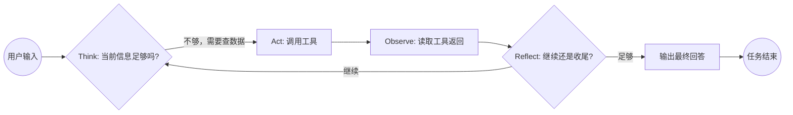

**本章课程目标：**  
- 建立对 AgentLoop 范式的定位：它和传统 Workflow、ReAct 的关系与区别。  
- 理解 AgentLoop 的核心循环：Think → Act → Observe → Reflect，以及它为什么适合电商搜索场景。  
- 初步认识 Globex 项目里的九个工具、四个核心属性，以及它们在 AgentLoop 循环中的位置。  

**学习建议：** 这一章不写代码，先建立概念地图。建议边读边画一条线：用户输入进来 → 主 AgentLoop 做了什么判断 → 调了哪个工具 → 观察结果后决定继续还是收尾。这条线画清楚了，后面的代码和工程就有框架可挂。  

---  

## 1、本章导读  

### 1.1 先看清这章在整体中的位置  

在前言里我们提到，这套项目分成两段：第 1 到 8 章是能力铺垫，第 9 到 15 章是 Globex 项目主线。  

本章是第一段的起点。它的作用是回答一个最基本的问题：**Globex 项目里的"智能体"到底按什么方式运行？**  

如果你之前用过 LangChain 的 Agent 或 LangGraph 的 StateGraph，可能会觉得"不就是让模型调工具吗"。这个理解没错，但还不够。AgentLoop 比"模型调工具"多了两件事：  
1. 它不是调一次就结束，而是持续循环，直到自己判断"信息够了，可以收尾"。  
2. 它能在循环过程中 fork 出自己的同质副本，让副本去处理子任务，自己继续主线。  

这两点决定了后面所有章节的设计基础。  

### 1.2 本章先做什么，不做什么  

本章完成的是：  
1. 搞清楚 AgentLoop 的核心循环长什么样。  
2. 对比同类方案，知道它"强在哪"和"适合什么场景"。  
3. 看一遍九个工具的全貌，建立分工印象。  

暂时不碰的是：  
- 环境搭建和依赖安装（下一章）。  
- 具体代码怎么写、stream 怎么读（下一章）。  
- 多 Agent fork 的三件事判断（第 3 章）。  

---  

## 2、什么是 AgentLoop  

什么是 Agent？  

  

### 2.1 核心循环：Think → Act → Observe → Reflect  

  

AgentLoop 是一种让模型"持续工作到任务完成"的执行范式。它的核心循环可以用四个词概括：  

| 阶段  | 做什么  |  
|-------|----------|  
| Think  | 分析当前状态，决定下一步该调用哪个工具、还是直接回答  |  
| Act  | 执行工具调用（如 ItemSearch / PriceCompare），拿到工具返回结果  |  
| Observe  | 读取工具返回的内容，评估信息是否足够  |  
| Reflect  | 判断：信息够了就走 Summary 收尾；不够就回到 Think 继续规划下一步  |  

这个循环不是固定执行一次，而是**可以反复进行**。一次完整的用户任务，可能经历 3 到 10+ 次循环，直到主 AgentLoop 自己决定"够了"。  



### 2.2 和"单次工具调用"的区别  

传统的"LLM + 工具调用"通常是这样的：  
```text  
用户提问 → 模型决定调一个工具 → 拿到结果 → 直接输出  
```  

这种方式适合简单查询（"今天天气怎么样"），但不适合复杂任务。比如用户说"帮我跨平台比价找一套旅行三件套"，模型需要：  
1. 先拆解需求（材质偏好、预算、品类）；  
2. 再跨 4 个平台搜索；  
3. 搜完之后还要比价、算运费；  
4. 最后才能给出清单。  

如果只调用一次工具就结束，根本完不成这个链路。AgentLoop 让模型可以"想多少步就走多少步"，自己判断终止条件。  

### 2.3 AgentLoop 不是一个框架名，是一种范式  

需要澄清的一点：AgentLoop 不是某个具体的开源库。它是一种**设计范式**——你可以基于 LangChain、甚至纯 OpenAI SDK 实现它。  

在 Globex 项目里，我们基于 LangChain 的底层能力（检查点、状态图、工具声明）来实现 AgentLoop 范式。但后面讲的所有概念（Think/Act/Observe/Reflect、fork 同质子 Agent、thread_id 隔离）都是**范式层的设计**，不绑定任何特定框架。  

---  

## 3、AgentLoop 的实现方案对比  

上一节说了 AgentLoop 是一种范式。但要把它落到代码里，你需要一个"执行引擎"——也就是承载 Think → Act → Observe → Reflect 这个循环的运行时架构。  

AgentLoop 最基础的形式就是一个 `while` 循环：模型输出 → 调工具 → 拿结果 → 再输出，串行到底。这在 demo 里够用，但进了生产环境，会撞上三个现实问题：**需要并行、需要断点续传、需要多 Agent 协同**。  

所以，真正能让 AgentLoop 范式落地的，是下面这四类运行时架构。它们不是"替代 AgentLoop"，而是**用不同的工程手段承载同一套思考逻辑**。  

### 3.1 四类运行时架构对比  

  

| 架构  | 代表框架  | 核心机制  | 适合场景  |  
|-------|-------------|-------------|-------------|  
| 状态图 / 有限状态机  | LangGraph、XState  | 节点 + 边，支持分支、并行、持久化断点  | 多步骤工作流、人机协作审批流  |  
| 事件驱动 / 消息总线  | AutoGen、CrewAI  | 发布/订阅，Agent 间异步解耦通信  | 多 Agent 辩论/协作、实时对话集群  |  
| 规划-执行分离  | Plan-and-Solve、LATS  | Planner 拆任务 → Executor 逐步执行，可纠错重规划  | 复杂研究任务、跨系统集成  |  
| 基于规则的流水线  | Dify Workflow、Coze Bot Flow  | 预定义 DAG，LLM 作为黑盒节点被调用  | 客服 SOP、数据 ETL、标准化业务  |  

### 3.2 为什么 Globex 选 LangChain（状态图路线）  

回到本教程的实际技术栈：四类架构中，Globex 走的是 **状态图路线**，具体技术选型是 **LangChain + LangGraph**。  

这个选择不是拍脑袋，而是和另外三类架构逐一比较后的取舍：  

**（1）为什么不用事件驱动（AutoGen / CrewAI）？**  

事件驱动架构的强项是"多 Agent 松耦合协作"——每个 Agent 独立运行、通过消息总线通信，适合 Agent 数量多且互不依赖的场景。但 Globex 的购物链路是**强顺序依赖**的：必须先搜商品、再比价、再精挑、最后出清单。用事件驱动意味着要把这条链拆成一堆异步消息，编排复杂度反而更高，而且断点续传和人工审批需要额外自建基础设施。  

**（2）为什么不用规划-执行分离（Plan-and-Solve / LATS）？**  

规划-执行架构的核心是"先把完整计划列出来，再逐步执行"，适合科研、代码生成这类任务。但电商搜索的关键难点不是"拆不出计划"——用户说"买旅行三件套"，计划本身就几句话——而是在**执行过程中碰到的硬约束**：搜索结果里有 80% 塑料制品、某个平台没货、关税让预算超了。这些信息只有执行到那一步才能知道，预先列计划没有意义。AgentLoop 的 Reflect 阶段更能应对这种"边走边看"的场景。  

**（3）为什么不用基于规则的流水线（Dify / Coze）？**  

流水线架构的确定性确实适合标准化业务，但 Globex 要求用户自由输入"便宜又抗造的旅行三件套，不要塑料，喜欢小众"——这种开放式的购物意图无法预定义为固定 DAG。如果硬用流水线做，每多一种偏好组合就要画一条分支，维护成本会随需求复杂度指数增长。  

**（4）为什么选 LangChain + LangGraph（状态图路线）？**  

排除了以上三类，状态图路线最适合 Globex，具体落地为 LangChain + LangGraph 组合：  
- **LangChain** 负责上层抽象：统一大模型接入（`init_chat_model`）、工具声明与绑定、Runnable 链式组合、消息格式标准化。  
- **LangGraph** 是 LangChain 生态中专门做状态图的子项目，负责底层执行引擎：循环控制、状态持久化（checkpoint）、条件分支、并行调度。  

可以这样理解：**LangChain 写 Agent 的"零件"（模型、工具、提示词），LangGraph 写 Agent 的"骨架"（循环、分支、断点恢复）**。  

选这套组合有三个直接理由：  
1. **状态图天然契合 AgentLoop**：Think → Act → Observe → Reflect 每一轮天然映射为 LangGraph 的节点 + 条件边。fork 子 Agent 时，每个子 Agent 有自己的 `thread_id` + checkpoint，状态完全隔离，并行搜索多个平台直接用图的并发语义表达。  
2. **生态统一**：工具定义（`@tool`）和状态图定义在同一个生态里，不需要桥接层。模型接入、提示词模板、输出解析都是一套 API——这意味着教程不需要在多个框架间来回切换。  
3. **生产可用**：checkpoint 持久化支持中断恢复和人工审批，断点续传能力是直接用 `while` 循环做不到的。  

---  

## 4、为什么电商搜索需要 AgentLoop  

### 4.1 传统搜索的三大瓶颈  

在前言里提过，传统电商搜索存在三个老大难：  

| 瓶颈  | 具体表现  | 根因  |  
|-------|-------------|-------|  
| 语义浅  | 用户说"便宜抗造的旅行三件套"，系统只能关键词匹配  | 没有拆解需求的能力  |  
| ID 稀疏  | 长尾商品、新品、跨平台商品缺乏行为数据  | 协同信号不足  |  
| 个性化与相关性打架  | 想推个性化的商品，但推出来跟 query 不相关  | 两个目标各自优化，缺乏统一决策  |  

### 4.2 Globex 怎么解决  

这三个瓶颈不是单靠 AgentLoop 一层就能搞定的。Globex 的整体解法是**决策层（AgentLoop）+ 召回层（三塔向量召回 / 语义搜索）**两层配合——AgentLoop 负责怎么规划、怎么调度、怎么纠错；三塔向量召回负责每一次检索本身的语义理解和个性化匹配（具体见第 4 章）。  

| 瓶颈  | 决策层：AgentLoop 怎么做  | 召回层：三塔向量召回 / 语义搜索怎么做  |  
|-------|--------------------------------|-------------------------------------------------------|  
| 语义浅  | Think 阶段：Planner 工具拆解用户自然语言，提取结构化属性  | Query 塔把自然语言编码成语义向量，"收纳袋"和"整理包"在向量空间里相邻，不再依赖字面关键词  |  
| ID 稀疏  | Act 阶段：fork 跨平台并行检索只是扩大候选**来源**，解决不了“无行为数据”这个根因（治标）  | **这里才是治本**：Item 塔用商品内容特征（标题 / 类目 / 属性 / 描述）编码，长尾、新品、跨语言商品没有行为 ID 也能进向量库被召回  |  
| 个性化打架  | Reflect 阶段：ItemPicker 工具基于用户长期偏好做二次精挑，兼顾两者  | User 塔把长期偏好编码成向量，与 Query 向量在召回阶段就联合打分，而不是事后再打补丁  |  

简单说：**AgentLoop 让"搜索"从一个一步到位的管道，变成了一个可以反复规划、反复调整的循环；三塔向量召回让循环里的每一次检索本身就带着语义理解和个性化偏好。** 两者缺一不可——只有 AgentLoop 没有语义召回，决策再好底层也只是关键词匹配；只有语义召回没有 AgentLoop，单轮命中再准也搞不定跨平台比价、属性补全这种多步任务。  

---  

## 5、一个最小的 AgentLoop 概念模型

不看代码，先用伪代码描述 AgentLoop 的最小模型：

```python
# 伪代码：AgentLoop 最小概念模型
def agent_loop(user_query, tools, system_prompt):
    messages = [system_prompt, user_query]

    while True:
        # Think: 模型根据当前消息历史做决策
        response = llm.generate(messages)

        if response.is_final_answer():
            # Reflect 判断：信息足够，直接输出
            return response.content

        if response.has_tool_call():
            # Act: 执行工具调用
            tool_name = response.tool_call.name
            tool_args = response.tool_call.arguments
            result = tools[tool_name].execute(tool_args)

            # Observe: 把工具结果追加到消息历史
            messages.append(response)          # 模型的工具调用请求
            messages.append(tool_result(result))  # 工具返回的结果

            # Reflect: 下一轮循环开始时，模型会看到工具结果，再次 Think
            continue
```

这段伪代码里有三个关键点：
1. **`while True`**：循环不是外部控制的，是模型自己决定什么时候 break（通过 `is_final_answer()`）。
2. **消息历史不断追加**：每次工具调用的结果都会成为下一轮 Think 的输入。
3. **没有预设步骤数**：模型可以调 1 次工具就结束，也可以调 10 次。

---

## 6、九个工具在 AgentLoop 中的位置


Globex 项目里，主 AgentLoop 可以调用九个工具。这些工具不是"子智能体"，它们是主 loop 循环里的"行动选项"。

| 工具名  | 归属  | 什么时候被主 loop 调用  |
|----------|-------|-------------------------------|
| Planner  | 内部  | Think 阶段判断"需求复杂，需要拆解"时  |
| ChatFallback  | 内部  | Think 阶段判断"这不是购物意图，是闲聊"时  |
| WebSearch  | 外部  | Think 阶段判断"需要外部事实补全"时  |
| CategoryInsight  | 外部  | Think 阶段判断"需要品类趋势 / 爆款数据"时  |
| ItemSearch  | 外部  | Think 阶段判断"需要检索商品"时  |
| ItemPicker  | 内部  | Reflect 阶段判断"搜回来的商品需要二次筛选"时  |
| PriceCompare  | 外部  | Reflect 阶段判断"需要跨平台比价"时  |
| ShippingCalc  | 外部  | Act 阶段计算"关税运费"时（通常和 ItemSearch 配合）  |
| ShoppingSummary  | 内部  | Reflect 阶段判断"信息足够，可以生成采购清单"时  |

这里有两个容易混的点：
- **内部工具**不需要调外部 API，靠模型自身能力完成（如 Planner 本质是结构化输出、ItemPicker 本质是偏好过滤）。
- **外部工具**需要调用真实的搜索引擎、比价接口或 RAG 知识库。

不需要现在记住每个工具的细节。后面第 11-13 章会逐个实现它们。这里只需要知道：**主 AgentLoop 在每一轮 Think 时，会从这九个选项中挑一个（或不挑，直接回答）。**

---

## 7、AgentLoop 的四个核心属性

每一个 AgentLoop 实例（无论是主 Agent 还是 fork 出来的子 Agent）都有四个核心属性：

| 属性  | 作用  | 类比  |
|-------|-------|-------|
| `thread_id`  | 当前会话的唯一标识，串起 WebSocket / 任务表 / 检查点 / 文件目录  | 身份证号  |
| `checkpoint`  | 保存当前执行到第几轮、消息历史是什么，支持断点恢复  | 存档点  |
| `tool_set`  | 这个 AgentLoop 实例可以调用的工具集合  | 工具箱  |
| `system_prompt`  | 指导模型行为的系统提示词，定义了"你是谁、你该怎么做"  | 角色说明书  |

关键理解：**当主 AgentLoop fork 出一个同质子 Agent 时，子 Agent 会获得独立的 `thread_id` 和 `checkpoint`，但共享同一套 `tool_set` 和 `system_prompt`。** 这就是"同质"的含义——它们是主 Agent 的完整克隆，只是执行上下文独立。

---

**本章小结：**

到这里，你应该对 AgentLoop 有了一个完整的概念印象：
1. AgentLoop 是一种让模型"持续循环直到任务完成"的执行范式，核心是 Think → Act → Observe → Reflect 循环。
2. 将 AgentLoop 落到工程里，Globex 选的是 LangChain（上层零件）+ LangGraph（底层状态图循环），这套组合既保留了 AgentLoop 的灵活性，又获得了并行、断点续传、多 Agent 隔离等生产级能力。
3. 电商搜索之所以需要 AgentLoop，是因为复杂的购物意图无法一步到位，需要反复规划、检索、比较、精挑。
4. 九个工具是主 loop 循环中的"行动选项"，不是独立的子智能体。
5. 每个 AgentLoop 实例有四个核心属性：`thread_id`、`checkpoint`、`tool_set`、`system_prompt`。

下一章「AgentLoop 快速入门与多轮工具调用」会搭建环境、跑通第一个 AgentLoop 示例，你会真正看到 Think → Act → Observe → Reflect 在代码里是怎么发生的。
