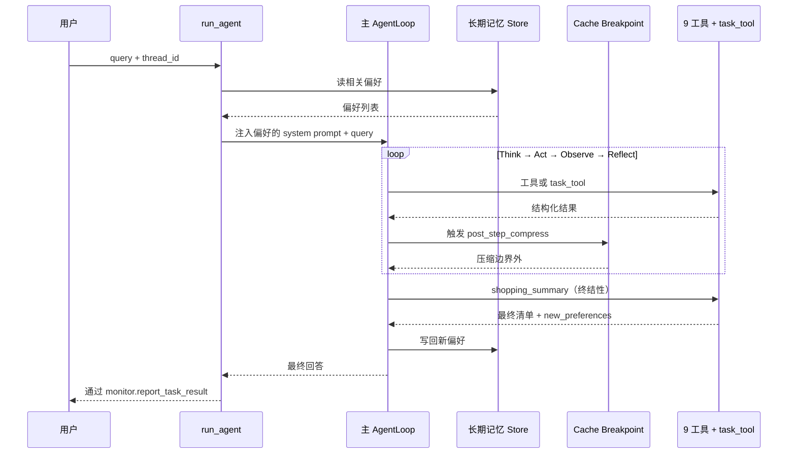

# Globex 主 AgentLoop 组装与收尾

## 5、主 AgentLoop 组装

### 5.1 主入口

```python
# app/agent/main_agent.py
MAIN_AGENT_MAX_ITERATIONS = 30
MAIN_AGENT_TIMEOUT_SEC = 300

def _build_main_agent(prompt: str):
    return create_react_agent(
        model=get_llm(),
        tools=FULL_TOOL_SET,
        prompt=prompt,
    )

async def run_agent(query: str, thread_id: str, user_id: str | None = None) -> dict:
    """主 AgentLoop 的入口。"""
    session_dir = ensure_session_dir(thread_id)
    set_thread_context(thread_id, session_dir)

    # 第 6 章：从 Store 读出该用户的长期偏好，注入 system prompt
    long_term = await store.read_relevant(user_id=user_id, query=query) if user_id else []

    pref_text = "\n".join(f"- {p.text}" for p in long_term) or "（暂无沉淀偏好）"
    prompt = get_system_prompt(long_term_preferences=pref_text)

    agent = _build_main_agent(prompt)

    try:
        result = await asyncio.wait_for(
            agent.ainvoke(
                {"messages": [("user", query)]},
                config={
                    "configurable": {"thread_id": thread_id},
                    "recursion_limit": MAIN_AGENT_MAX_ITERATIONS,
                },
            ),
            timeout=MAIN_AGENT_TIMEOUT_SEC,
        )
    except asyncio.TimeoutError:
        await monitor.report_error("timeout", f"主任务超时 {MAIN_AGENT_TIMEOUT_SEC}s")
        return {"status": "timeout", "thread_id": thread_id}

    # 第 6 章：把本轮新偏好写回 Store
    final_msg = result["messages"][-1]
    if hasattr(final_msg, "additional_kwargs"):
        new_prefs = final_msg.additional_kwargs.get("learned_preferences", [])

        if user_id and new_prefs:
            await store.write_many(user_id=user_id, texts=new_prefs)

    await monitor.report_task_result(final_msg.content)
    return {"status": "ok", "thread_id": thread_id, "final": final_msg.content}
```

### 5.2 接 Cache Breakpoint

主 loop 每跑完一轮 Act，由 LangGraph 钩子触发一次“边界外消息压缩”：

```python
# app/agent/middleware.py（续）
from app.compress.breakpoint import compute_breakpoint
from app.compress.compressor import compress_messages

async def post_step_compress(state: dict) -> dict:
    """每轮 Act 之后调用，压缩边界外的工具结果。"""
    messages = state["messages"]
    breakpoint = compute_breakpoint(messages, keep_recent=3)

    if breakpoint == len(messages):
        return state  # 还没触发压缩

    compressed = await compress_messages(messages[:breakpoint])
    state["messages"] = compressed + messages[breakpoint:]
    return state
```

把它注册到 `create_react_agent` 的 `post_model_hook`（LangGraph 0.2+ 提供该钩子）。

这样主 loop 即使进行 50 轮对话，也能通过 Cache Breakpoint 压缩较早的上下文，控制 token 规模，同时尽量保持 Prompt Cache 命中率。其核心动机已在第 5 章介绍。

### 5.3 完整链路一次走完



---

## 6、提示词里要补的话术

第 10 章 `prompts.yml` 已经写了 fork 三件事 + 9 工具。本章新增需要补的内容如下：

```yaml
# 追加到 system_prompt 末尾

# 收尾规则
当你已经拿到 ItemPicker 的精选清单且不少于 1 件时：
  - 立刻调用 shopping_summary（终结性工具）
  - 不要再调任何检索类工具
  - 把本轮识别到的新偏好（如"不要塑料"）放进 shopping_summary 的 new_preferences 参数

# fork 防失控提醒
- 子任务尽量在 1 层 fork 内完成；如果 dispatch_tool 返回"[dispatch_tool 拒绝]"或"[dispatch_tool 超时]"，请立即换思路。
- 如果同一工具你已重复调用 4 次仍没进展，请检查参数是否合理，必要时调 chat_fallback 与用户对齐再继续。
```

这些规则也是第 8 章 P1 项 Rubric 的扣分点，因此会和评测体系自然挂钩。

---

## 7、本章工程小结

| 模块 | 解决什么 |
|---|---|
| `tool_registry.py` | 主 / 子共享同一份 `FULL_TOOL_SET` |
| `fork_guard.py` | fork 深度 `ContextVar` + `ForkLimitExceeded` |
| 升级版 `dispatch_tool` | depth + timeout + 把异常转成“工具结果” |
| `truncate_long_tool_result` | 单工具一次结果不能炸主 loop |
| `LoopDetector` | 同工具调用 4 次以上提示模型收敛 |
| `post_step_compress` | 每轮 Act 后接 Cache Breakpoint 压缩 |
| `run_agent` | 主入口，串 Store 注入 + 主 loop + 写回 |

---

## 本章小结

到这里，Globex 主 AgentLoop 已经能完整跑通：

- 9 个工具 + `dispatch_tool` 元工具使用同一份 `FULL_TOOL_SET`，统一注册到主 / 子 AgentLoop。
- `ItemPicker` 用“硬约束 + 软偏好”的两段式策略进行精挑，`ShoppingSummary` 作为终结性工具负责收尾。
- fork 防失控四件套包括：**深度上限、超时、单结果截断、循环检测**。核心思想都是尽可能把异常转回“工具结果”，交由主 loop 自己处理，而不是让整个 Agent 崩溃。
- Cache Breakpoint 接到主 loop 的 post-step 钩子，在长对话场景中控制 token 规模，同时尽量保持缓存命中。
- 长期记忆 Store 在入口注入、出口写回，从而在主 AgentLoop 维度形成完整的数据闭环。
