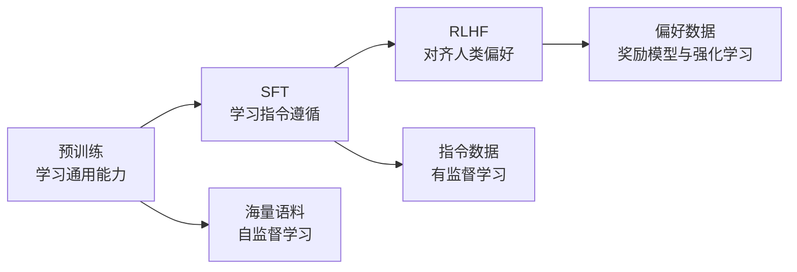
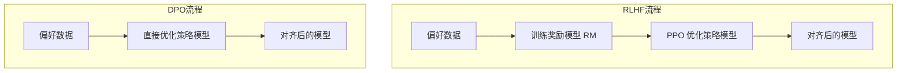
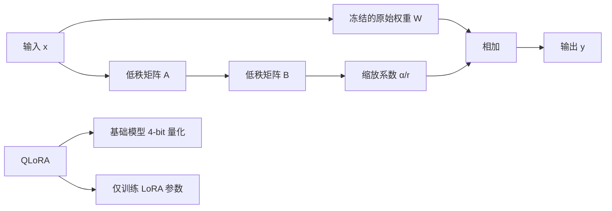
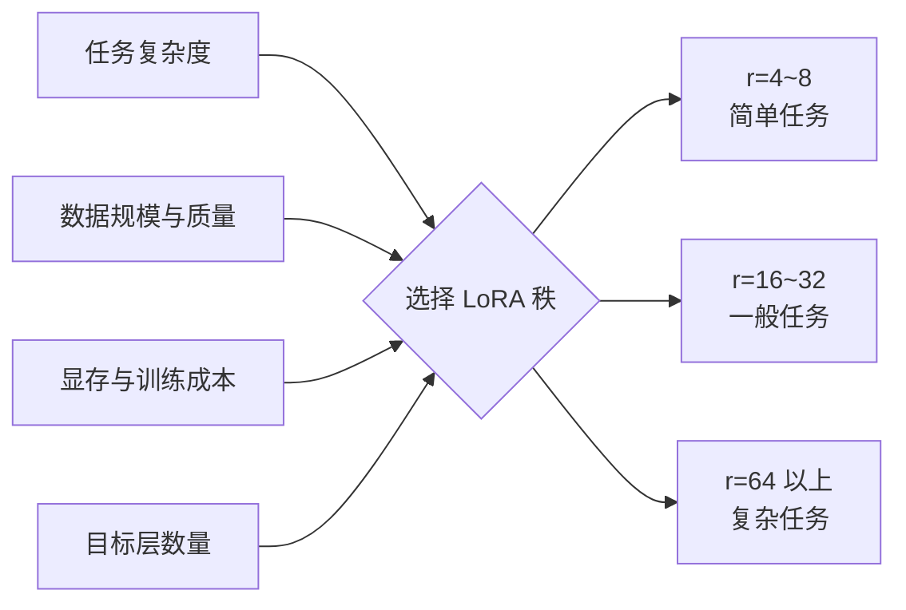
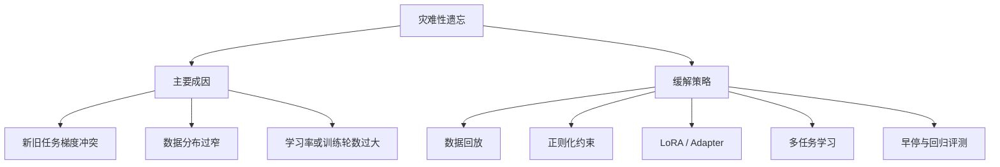
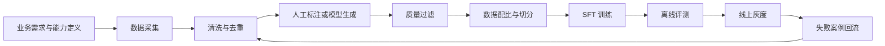

# 大模型训练与微调面试题

> 本文整理了大模型训练与微调中的高频面试题，覆盖预训练、SFT、RLHF、DPO、LoRA、QLoRA、灾难性遗忘和数据构造等核心知识点。

## 目录

1. [大模型训练的完整流程：预训练 → SFT → RLHF](#题目1大模型训练的完整流程预训练--sft--rlhf)
2. [RLHF 和 DPO 的原理及区别](#题目2rlhf-和-dpo-的原理及区别)
3. [LoRA 和 QLoRA 的微调原理](#题目3lora-和-qlora-的微调原理)
4. [如何选择 LoRA 的秩](#题目4如何选择-lora-的秩)
5. [什么是灾难性遗忘，如何缓解](#题目5什么是灾难性遗忘如何缓解)
6. [SFT 数据构造技巧](#题目6sft-数据构造技巧)
7. [总结](#总结)

---

## 题目1：大模型训练的完整流程：预训练 → SFT → RLHF

**难度：⭐⭐⭐ 中级**

### 1. Common Answer

大模型训练通常可以分为三个主要阶段：

1. **预训练（Pre-training）**  
   在海量文本数据上进行自监督学习，让模型学习语言规律、事实知识和一定的推理能力。对于自回归语言模型，常见训练目标是根据前面的 Token 预测下一个 Token。

2. **有监督微调（Supervised Fine-Tuning，SFT）**  
   使用高质量的“指令—回答”数据进行有监督训练，让模型学会理解任务、遵循指令，并按照人类期望的方式组织答案。

3. **基于人类反馈的强化学习（Reinforcement Learning from Human Feedback，RLHF）**  
   使用人类偏好数据训练奖励模型，再通过 PPO 等强化学习算法优化语言模型，使模型输出更加符合人类偏好、安全要求和产品目标。

### 2. Impressive Answer

我会从三个维度介绍大模型的训练流程：**数据与目标、训练方式和价值贡献**。

第一个维度是数据与目标。预训练使用互联网文本、书籍、代码等大规模语料，目标是让模型学习语言规律、世界知识和基础能力；SFT 使用经过筛选和标注的指令数据，目标是让模型学会理解任务和遵循指令；RLHF 使用人类对多个回答的偏好排序数据，目标是让模型的输出更加符合人类价值、交互习惯和安全要求。

第二个维度是训练方式。预训练通常采用自监督的自回归训练，通过交叉熵损失预测下一个 Token；SFT 本质上仍然是交叉熵训练，只是训练数据变成了“指令—回答”对，而且通常只计算回答部分的损失；RLHF 则先训练奖励模型，再使用 PPO 等强化学习算法优化策略模型，同时通过 KL 约束避免模型偏离参考模型过远。

第三个维度是价值贡献。预训练决定模型的能力基础和能力上限，可以理解为建立“通用能力”；SFT 将通用能力转化为可交互、可执行的任务能力；RLHF 进一步优化模型的帮助性、安全性和人类偏好对齐程度。三者关注点不同：预训练解决“会不会”，SFT 解决“听不听得懂、会不会按要求做”，RLHF 解决“回答是否更符合人类期望”。

### 3. Key Differences

| 阶段 | 数据类型 | 训练目标 | 常见损失或算法 | 主要价值 |
|---|---|---|---|---|
| 预训练 | 海量无人工标注语料 | 学习语言规律和世界知识 | 自回归交叉熵损失 | 通用能力基础 |
| SFT | 指令—回答对 | 学习指令遵循和任务格式 | 交叉熵损失 | 可用性 |
| RLHF | 人类偏好对比数据 | 对齐人类偏好与安全要求 | 奖励模型 + PPO 等 | 对齐性与安全性 |

### 关联题目

| 题号 | 题目 | 难度 |
|---|---|---|
| 2 | RLHF 与 DPO 原理对比 | ⭐⭐⭐⭐ |
| 3 | LoRA 与 QLoRA 微调原理 | ⭐⭐⭐ |
| 6 | SFT 数据构造技巧 | ⭐⭐⭐ |

---

## 题目2：RLHF 和 DPO 的原理及区别

**难度：⭐⭐⭐⭐ 高级**

### 1. Common Answer

#### RLHF

RLHF 的典型流程包括：

1. 收集人类偏好数据，例如对同一个问题的多个回答进行优劣排序。
2. 根据偏好数据训练奖励模型（Reward Model，RM）。
3. 使用 PPO 等强化学习算法优化策略模型，使其最大化奖励模型给出的分数。

#### DPO

DPO（Direct Preference Optimization，直接偏好优化）不显式训练奖励模型，也不需要在线运行 PPO。它直接使用“优选回答”和“拒绝回答”组成的偏好数据，对策略模型进行监督式优化。

#### 核心区别

RLHF 显式训练奖励模型，再通过强化学习优化策略；DPO 将带有 KL 约束的偏好优化目标转化为一个可以直接训练策略模型的分类式损失，流程更加简单和稳定。

### 2. Impressive Answer

我会从四个角度回答：**核心思想、实现路径、优缺点和适用场景**。

第一个角度是核心思想。RLHF 显式建模人类偏好：先训练一个奖励模型来近似人类的评价，再让策略模型最大化奖励。DPO 则不单独训练奖励模型，而是利用策略模型相对于参考模型的对数概率差，直接提高优选回答的概率、降低拒绝回答的概率。

第二个角度是实现路径。RLHF 通常需要经历 SFT 模型准备、偏好数据构造、奖励模型训练和 PPO 优化等阶段。PPO 训练过程中还需要同时维护策略模型、参考模型、奖励模型和价值模型，因此工程链路较复杂。DPO 只需要策略模型、参考模型和离线偏好数据，可以像普通监督微调一样训练。

第三个角度是优缺点。RLHF 的优势是目标设计灵活，奖励模型可以与规则、安全模型等组合，也适合在线采样和多轮迭代；缺点是系统复杂、显存开销大、训练不稳定，并可能出现奖励黑客。DPO 的优势是实现简单、训练稳定、资源成本较低；缺点是依赖固定的离线偏好数据，对训练数据覆盖范围较为敏感，也不适合所有需要在线探索的场景。

第四个角度是适用场景。若业务需要复杂奖励组合、在线探索或持续收集模型生成结果进行迭代，RLHF 更合适；若已经具备高质量的离线偏好数据，希望以较低成本完成模型对齐，DPO 通常是更高效的方案。

### 3. Key Differences

| 维度 | RLHF | DPO |
|---|---|---|
| 核心思想 | 显式训练奖励模型并优化奖励 | 直接使用偏好数据优化策略 |
| 训练流程 | 奖励模型训练 + PPO 优化 | 类监督学习的一阶段优化 |
| 是否需要奖励模型 | 需要 | 不需要显式奖励模型 |
| 是否需要价值模型 | PPO 通常需要 | 不需要 |
| 在线采样 | 通常需要模型生成样本 | 通常使用离线偏好数据 |
| 训练稳定性 | 相对较低 | 相对较高 |
| 工程复杂度 | 高 | 低 |
| 资源占用 | 较高 | 较低 |
| 目标灵活性 | 较强 | 相对受限 |

### 关联题目

| 题号 | 题目 | 难度 |
|---|---|---|
| 1 | 预训练、SFT 与 RLHF 三阶段流程 | ⭐⭐⭐ |
| 4 | PPO 算法原理 | ⭐⭐⭐⭐ |
| 6 | 奖励模型训练技巧 | ⭐⭐⭐⭐ |

---

## 题目3：LoRA 和 QLoRA 的微调原理

**难度：⭐⭐⭐ 中级**

### 1. Common Answer

#### LoRA

LoRA（Low-Rank Adaptation，低秩适配）的做法是冻结预训练模型的原始权重，在部分线性层旁增加两个可训练的低秩矩阵。对于原始权重矩阵 \(W\)，训练过程中不直接更新 \(W\)，而是学习：

\[
\Delta W = BA
\]

其中低秩矩阵的秩 \(r\) 远小于原矩阵的维度。模型前向传播可表示为：

\[
y = Wx + \frac{\alpha}{r}BAx
\]

训练时只更新 \(A\) 和 \(B\)，因此可训练参数和优化器状态大幅减少。

#### QLoRA

QLoRA 在 LoRA 的基础上，将冻结的基础模型权重量化为 4-bit，并在量化模型上训练 LoRA 参数，从而进一步降低显存占用。QLoRA 常见技术包括 NF4、双重量化和分页优化器。

#### 为什么低秩分解有效

1. 下游任务微调所需的权重更新往往具有较低的内在维度。
2. 并非所有参数方向都对新任务同样重要。
3. 低秩约束减少了可训练自由度，具有一定正则化作用。
4. 预训练模型已经具备大量通用能力，微调主要是对已有能力进行重组和激活。

### 2. Impressive Answer

我会从三个角度回答：**技术原理、有效性解释和实践选择**。

第一个角度是技术原理。LoRA 的核心假设是，模型适应下游任务时所需要的参数更新 \(\Delta W\) 具有较低的内在秩。因此，它不直接更新完整的 \(d_{\text{out}} \times d_{\text{in}}\) 权重矩阵，而是用两个较小矩阵表示更新量：

\[
A \in \mathbb{R}^{r \times d_{\text{in}}}, \qquad
B \in \mathbb{R}^{d_{\text{out}} \times r}
\]

当 \(r \ll \min(d_{\text{in}}, d_{\text{out}})\) 时，可训练参数量会从 \(d_{\text{out}}d_{\text{in}}\) 降低到：

\[
r(d_{\text{in}} + d_{\text{out}})
\]

QLoRA 则把基础模型以 4-bit 形式存储，在前向和反向计算时按需要反量化到更高精度，同时只更新 LoRA 参数，因此显著降低了模型权重和优化器带来的显存压力。

第二个角度是为什么低秩更新能够生效。预训练模型已经学习了较完整的语言和知识表示，下游任务通常不需要重建全部能力，而是调整少量关键方向。例如，让模型学习新的回答格式、领域术语或任务偏好，往往只需改变参数空间中的少数方向。LoRA 用低秩矩阵限制了更新子空间，既保留基础模型能力，也能表达任务相关变化。

第三个角度是实践选择。显存较充足、追求训练速度时，可以使用 BF16 或 FP16 基础模型配合 LoRA；显存非常有限时，可以使用 QLoRA。QLoRA 通常会带来一定量化和反量化开销，但能显著降低显存需求。LoRA 的目标层通常优先选择注意力层中的 `q_proj`、`k_proj`、`v_proj`、`o_proj`，复杂任务还可以进一步覆盖 MLP 层。

### 3. Key Differences

| 维度 | LoRA | QLoRA | 全量微调 |
|---|---|---|---|
| 基础模型权重 | 冻结，通常为 BF16/FP16 | 冻结，通常量化为 4-bit | 参与更新 |
| 可训练参数 | 少量 LoRA 参数 | 少量 LoRA 参数 | 全部参数 |
| 显存占用 | 较低 | 很低 | 很高 |
| 训练速度 | 通常较快 | 可能受反量化影响 | 计算量大 |
| 部署方式 | 可合并权重或加载适配器 | 通常加载量化模型与适配器 | 完整模型 |
| 适用场景 | 常规参数高效微调 | 显存极度有限 | 资源充足、追求完整更新 |

### 关联题目

| 题号 | 题目 | 难度 |
|---|---|---|
| 4 | LoRA 秩的选择策略 | ⭐⭐⭐ |
| 5 | 灾难性遗忘的成因与缓解 | ⭐⭐⭐⭐ |

---

## 题目4：如何选择 LoRA 的秩

**难度：⭐⭐⭐ 中级**

### 1. Common Answer

常见秩值可以参考：

- \(r=4\sim8\)：参数量极小，适合格式学习、分类等简单任务。
- \(r=16\sim32\)：表达能力和资源消耗较平衡，是常用区间。
- \(r=64\sim128\)：适合较复杂任务，但显存、参数量和过拟合风险都会增加。

秩太小时，LoRA 的表达能力不足，可能导致欠拟合；秩增大后，模型能够学习更复杂的参数更新，但收益通常会逐渐递减。因此，一般可以从 \(r=8\) 或 \(r=16\) 开始，通过验证集实验进行选择。

### 2. Impressive Answer

我会从三个角度回答：**选择原则、性能影响和实验方法**。

第一个角度是选择原则。LoRA 的秩决定了更新矩阵能够表示多少个独立方向，本质上是在表达能力、泛化能力和资源成本之间权衡。任务越复杂、领域差异越大、需要修改的模块越多，通常需要更大的秩；数据量较小或任务模式简单时，小秩往往已经足够。除此之外，秩还应与 LoRA 作用的目标层共同考虑：覆盖更多层和增大秩都会提升参数容量。

第二个角度是性能影响。秩过小会限制更新子空间，表现为训练损失下降缓慢、训练集和验证集都表现不佳；秩适中时，通常能获得较好的性能与资源平衡；秩过大并不一定持续提升效果，因为参数量增加后可能出现收益递减，并提高过拟合风险。需要强调的是，不能笼统地认为某个秩一定能够达到全量微调的固定百分比，具体表现依赖模型规模、数据质量、目标层和任务难度。

第三个角度是实验方法。实践中可以先使用 \(r=8\) 或 \(r=16\)，保持其他超参数不变，测试 \(r \in \{8,16,32,64\}\)。重点观察训练损失、验证集指标、通用能力变化、显存占用和训练时长。如果训练集和验证集都较差，可以增大秩或增加目标层；如果训练集较好但验证集下降，应优先检查数据质量、学习率、训练轮数和正则化，而不是只依靠减小秩。

在电商导购 Agent 场景中，可以用下面的方式理解：

1. “防晒霜有哪些品牌？”主要是简单的商品知识问答，可能从较小的秩开始，例如 \(r=8\sim16\)。
2. “我身高 171 cm，想找裙长 80 cm 左右的连衣裙。”涉及条件理解和个性化匹配，可以尝试 \(r=16\sim32\)。
3. “敏感肌且预算有限，需要同时考虑肤质、价格和品牌。”涉及多约束推理和推荐，可以尝试 \(r=32\) 或更高，再通过验证集判断是否值得继续增大。

这些数值只能作为实验起点，最终仍然需要基于实际数据进行消融实验。

### 3. Key Differences

| 秩范围 | 参数量 | 适用场景 | 可能表现 |
|---|---|---|---|
| \(r=4\sim8\) | 很低 | 格式学习、分类、简单问答 | 复杂任务可能欠拟合 |
| \(r=16\sim32\) | 较低 | 多数通用微调任务 | 性价比较高 |
| \(r=64\sim128\) | 较高 | 复杂领域迁移、较大数据集 | 收益递减或过拟合 |

### 关联题目

| 题号 | 题目 | 难度 |
|---|---|---|
| 3 | LoRA 与 QLoRA 微调原理 | ⭐⭐⭐ |
| 5 | 灾难性遗忘的成因与缓解 | ⭐⭐⭐⭐ |

---

## 题目5：什么是灾难性遗忘，如何缓解

**难度：⭐⭐⭐⭐ 高级**

### 1. Common Answer

灾难性遗忘是指模型在学习新任务或新数据时，原有任务能力和通用知识明显下降。例如，模型经过领域 SFT 后，虽然专业问答能力提高，但通用对话、推理或指令遵循能力下降。

常见缓解方法包括：

1. **数据回放或数据混合**：在领域数据中混入通用指令数据或旧任务数据。
2. **正则化约束**：通过 L2、EWC 等方法限制重要参数发生过大变化。
3. **参数高效微调**：使用 LoRA、Adapter 等方法冻结基础模型参数。
4. **多任务学习**：同时训练新旧任务，减少模型向单一任务分布过度偏移。
5. **降低训练强度**：控制学习率、训练轮数和数据重复次数。

### 2. Impressive Answer

我会从三个角度回答：**成因分析、缓解策略和实践评估**。

第一个角度是成因分析。灾难性遗忘的本质是新任务的梯度更新破坏了旧任务所依赖的参数表示。预训练模型中的通用知识和能力分布在大量参数中，当微调数据分布过窄、学习率过大或训练轮数过多时，模型会过度适应新数据，导致原有能力下降。新旧任务梯度冲突越明显，遗忘现象通常越严重。

第二个角度是缓解策略。数据层面，可以在领域 SFT 数据中混入一定比例的通用指令数据、旧任务数据或高质量预训练样本。算法层面，可以使用 EWC、L2-SP、KL 约束等方法限制模型偏离原始模型。架构层面，可以使用 LoRA、Adapter 或专家模块，将新知识尽量存储在新增参数中。训练策略层面，可以降低学习率、减少训练轮数、使用早停，并对不同类型的数据设置合适的采样权重。

第三个角度是实践评估。缓解灾难性遗忘不能只看领域任务指标，必须同时建立“领域能力集”和“通用能力回归集”。训练后既要评估新任务提升，也要检查通用问答、推理、代码、安全性和指令遵循能力是否下降。数据回放比例没有固定答案，可以从 5%～20% 的通用数据开始实验，再根据领域指标和通用指标共同调整。

需要注意，LoRA 能降低对原始权重的直接破坏，但不等于完全不会遗忘。模型加载 LoRA 适配器后，输出仍然可能明显偏向新领域；同时，简单增大秩也不一定减少遗忘，秩越大意味着 LoRA 拥有更强的拟合能力，若数据过窄或训练过度，反而可能强化领域偏移。因此，LoRA 秩应与数据混合、学习率、训练轮数和验证集评估结合选择。

### 3. Key Differences

| 缓解方法 | 原理 | 优点 | 局限 |
|---|---|---|---|
| 数据回放 | 混入旧任务或通用数据 | 简单、有效、容易落地 | 增加训练成本 |
| EWC 等正则化 | 约束重要参数变化 | 不一定需要保存全部旧数据 | 参数重要性估计复杂 |
| LoRA/Adapter | 冻结基础模型，新增少量参数 | 训练成本低，便于多任务切换 | 不能完全避免输出分布偏移 |
| 多任务学习 | 同时优化多个任务 | 有助于保持综合能力 | 任务权重和梯度冲突难调 |
| 早停与小学习率 | 降低参数更新幅度 | 实现简单 | 可能限制新任务学习 |

### 关联题目

| 题号 | 题目 | 难度 |
|---|---|---|
| 3 | LoRA 与 QLoRA 微调原理 | ⭐⭐⭐ |
| 6 | SFT 数据构造技巧 | ⭐⭐⭐ |

---

## 题目6：SFT 数据构造技巧

**难度：⭐⭐⭐ 中级**

### 1. Common Answer

SFT 数据构造主要关注以下方面：

#### 数据质量

1. 保证指令清晰、回答准确、逻辑完整。
2. 进行人工校验和自动筛选，去除错误、冲突和低质量样本。
3. 清理重复数据、模板化数据和异常格式。
4. 保证训练数据与真实应用场景一致。

#### 数据多样性

1. 覆盖不同任务类型。
2. 覆盖不同指令表达方式。
3. 覆盖简单、中等和复杂任务。
4. 覆盖单轮与多轮对话。
5. 覆盖常见问题和长尾问题。

#### 数据增强

1. Self-Instruct：使用模型生成新的指令和回答。
2. 指令改写：对相同意图生成不同表达方式。
3. 回答重写：改变回答的格式、长度、语气和组织方式。
4. 合成复杂样本：增加多约束、长上下文和推理任务。
5. 使用拒答和边界样本训练安全行为。

### 2. Impressive Answer

我会从三个角度回答：**质量控制、多样性设计和数据闭环**。

第一个角度是质量控制。SFT 数据质量通常比单纯的数据量更重要。样本层面，要保证指令无歧义、回答正确、信息充分且格式一致；清洗层面，可以使用规则、去重模型、质量打分模型和人工审核组合过滤；领域任务还需要专业人员校验事实。对于多轮对话，还要检查角色是否错位、上下文是否连续，以及回答是否真正利用了前文信息。

第二个角度是多样性设计。任务类型应覆盖实际产品中的问答、摘要、信息抽取、工具调用、推荐、拒答和多轮澄清等能力；指令风格要覆盖口语、书面语、简短指令、模糊表达和带约束的复杂指令；难度上应形成从简单到复杂的梯度。同时需要控制数据分布，避免某一类模板样本数量过多，让模型形成固定回答套路。

第三个角度是数据闭环。真实业务中的失败案例通常比随机合成数据更有价值。可以从线上日志中筛选低满意度、工具调用失败、格式错误和幻觉案例，完成脱敏、标注和修正后加入训练集。训练完成后，再通过离线评测和灰度测试发现新的问题，形成“线上问题收集—标注修复—SFT 训练—评测回归”的持续迭代闭环。

在数据增强方面，可以使用 Self-Instruct 和强模型生成候选样本，但合成数据必须经过筛选，避免错误被批量放大。对于推理任务，可以加入过程监督或结构化推理数据；但并不是所有任务都需要冗长思维链，简单任务应保留简洁答案，防止模型养成过度解释的习惯。

### 3. 数据构造流程

### 4. Key Differences

| 技巧 | 适用场景 | 优点 | 局限 |
|---|---|---|---|
| 高质量筛选 | 所有场景 | 直接提升训练数据可靠性 | 需要人工或模型成本 |
| Self-Instruct | 数据量不足 | 能快速扩展指令覆盖 | 容易引入模型错误 |
| 指令与回答重写 | 表达方式单一 | 增加语言和格式多样性 | 不一定增加任务多样性 |
| 推理数据增强 | 数学、代码、复杂决策 | 提升复杂任务能力 | 标注成本高 |
| 线上失败案例回流 | 已上线产品 | 与真实问题高度相关 | 需要脱敏、归因和标注 |
| 数据配比控制 | 多任务训练 | 防止某类任务占比过高 | 需要持续实验 |

### 5. 实践检查清单

- 指令是否清晰且不存在多种互相冲突的解释？
- 回答是否事实正确、逻辑完整？
- 是否存在重复样本、近重复样本和模板污染？
- 数据格式是否与推理阶段的 Chat Template 一致？
- 是否覆盖业务核心任务、长尾任务和失败场景？
- 是否包含必要的拒答、安全和工具调用样本？
- 训练集、验证集和测试集是否避免数据泄漏？
- 是否建立通用能力与领域能力的双重评测集？

### 关联题目

| 题号 | 题目 | 难度 |
|---|---|---|
| 1 | 预训练、SFT 与 RLHF 三阶段流程 | ⭐⭐⭐ |
| 5 | 灾难性遗忘的成因与缓解 | ⭐⭐⭐⭐ |

---

## 总结

本文覆盖了训练与微调中的核心知识点：

- **预训练、SFT 与 RLHF**：预训练建立通用能力，SFT 建立指令遵循能力，RLHF 优化人类偏好对齐。
- **RLHF 与 DPO**：RLHF 通过奖励模型和强化学习进行显式偏好优化；DPO 直接使用偏好数据训练策略模型，工程实现更加简单。
- **LoRA 与 QLoRA**：通过低秩更新减少可训练参数，QLoRA 进一步使用 4-bit 量化降低显存占用。
- **LoRA 秩选择**：需要结合任务复杂度、数据规模、目标层和硬件资源，通过消融实验确定。
- **灾难性遗忘**：可通过数据回放、正则化、参数高效微调、多任务学习和训练强度控制进行缓解。
- **SFT 数据构造**：数据质量、任务多样性、分布配比和真实失败案例闭环共同决定训练效果。

## 学习建议

1. 先理解各训练阶段解决的问题，不要只背流程。
2. 掌握 LoRA 参数量计算、目标层选择和秩的调节方法。
3. 理解 RLHF、DPO 的目标函数和工程差异。
4. 重视数据清洗、配比和评测集设计。
5. 面试回答时先讲核心结论，再补充流程、优缺点和实践经验。

## 进阶方向

- PPO、GRPO 等强化学习算法。
- Reward Model 与 Process Reward Model。
- ORPO、KTO、IPO、SimPO 等偏好优化方法。
- AdaLoRA、DoRA、LoRA+ 等参数高效微调方法。
- 多模态模型的预训练、指令微调和偏好对齐。
