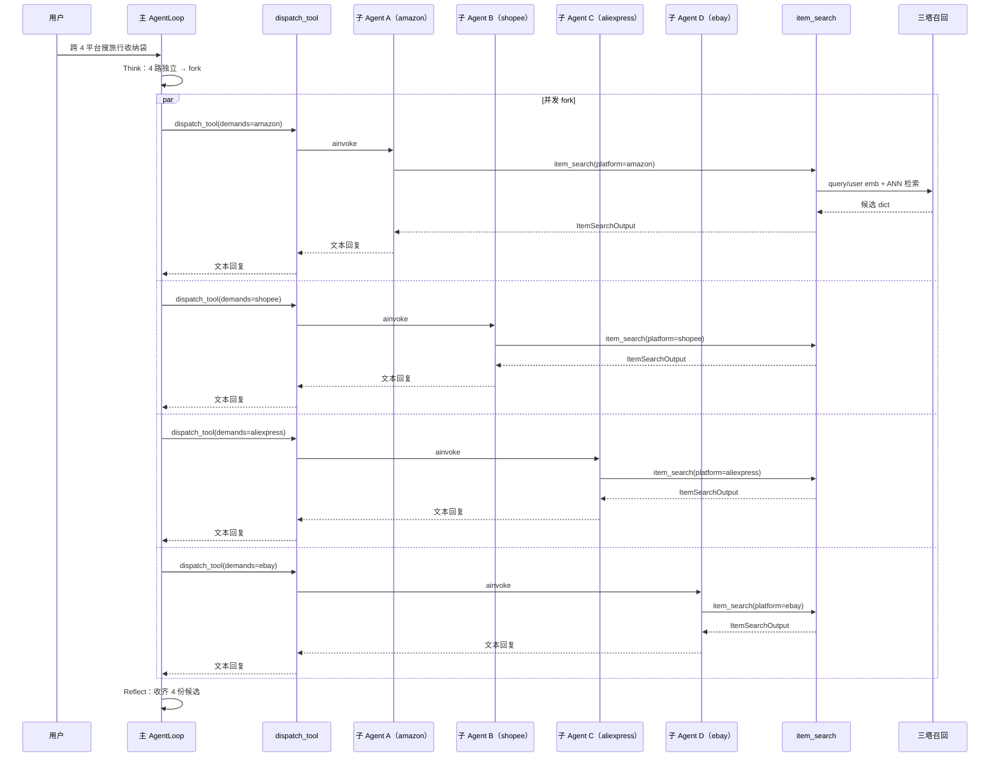

# 11 ItemSearch 商品检索工具实现与跨平台 fork 触发场景

**本章课程目标：**
- 把第 4 章「LLM 三塔向量召回」真正接到一个 Agent 工具上：实现 `item_search` 工具，让模型一次调用就能拿到一个平台的候选商品。
- 第一次跑通"主 AgentLoop fork 4 个同质子 AgentLoop 各自调一次 ItemSearch"的完整链路，看清 fork 三件事判断的"能并行"在工程层是怎么落的。
- 理解工具入参 / 出参的设计原则——给模型看的字段尽量小、给后续工具用的结构尽量稳。

**学习建议：** 这一章是 Globex 第一个真正有"业务味"的工具。看代码时关注三件事：(1) 工具签名是怎么让模型不绕弯就用对；(2) 三塔召回怎么作为内部依赖被复用；(3) 主 loop 在什么时候选择 fork 而不是自己串行调用。

---

## 1、本章导读

### 1.1 ItemSearch 在整张大图里的位置

把第 9 章那张总图缩到 ItemSearch 这一段：
```text
用户购物意图
  -> Planner 拆解（预算 / 品类 / 偏好）
  -> 主 AgentLoop 在 Think 阶段判断："要跨 4 个平台"
  -> dispatch_tool ×4 fork 4 个同质子 AgentLoop
       ├─ 子 A：调 item_search(platform="amazon", ...)
       ├─ 子 B：调 item_search(platform="shopee", ...)
       ├─ 子 C：调 item_search(platform="aliexpress", ...)
       └─ 子 D：调 item_search(platform="ebay", ...)
  -> 4 份候选合流回主 loop
  -> PriceCompare / ShippingCalc / ItemPicker / ShoppingSummary

```

ItemSearch 是这张图里**最频繁被调用的工具**，也是**最容易决定整体延迟和质量的工具**。本章把它和"跨平台 fork"两个事情一起做，因为它们天然耦合。

### 1.2 本章先做什么，不做什么

要做的：
1. 设计 `item_search` 的工具签名：模型应该传什么、得到什么。
2. 在工具内部接入第 4 章的三塔向量召回（User 塔 + Query 塔 + Item 塔 + ANN）。
3. 实现"语义 + 个性化"双通道召回的合并。
4. 串通主 loop 的 fork 三件事判断：什么时候跨平台 fork、什么时候单平台主 loop 自己跑。

不做的：
- 比价、运费、精挑、最终清单留给第 12-14 章。
- 真实平台 API 的合规接入（OAuth / 反爬虫）超出本课程范围，本章的"跨平台调用"是统一的 SearchClient 抽象。

---

## 2、工具签名设计：让模型一眼看懂

### 2.1 为什么签名比实现还重要

Agent 工具的真正"用户"是大模型本身。一个签名不友好的工具，会出现这些问题：

| 签名问题  | 模型典型行为  |
|-------------|-------------------|
| 入参太多 / 互斥参数没说明  | 模型挑错参数 / 重复尝试 / 触发死循环  |
| 入参允许自由 JSON  | 模型瞎写键名，每次调用结构不同  |
| 出参全是嵌套 dict 没字段说明  | 后续工具读不到关键字段  |
| 出参把 100 件商品全平铺  | token 爆炸，主 loop Reflect 阶段被淹  |

设计原则：**入参少而正交，出参字段名稳定且可被后续工具消费。**

### 2.2 ItemSearch 的最终签名
```python
# app/tools/item_search.py
from langchain_core.tools import tool
from pydantic import BaseModel, Field
from typing import Literal

class Candidate(BaseModel):
    """单个候选商品的稳定结构（后续工具按这个 schema 消费）。"""
    item_id: str
    platform: str
    title: str
    price: float
    currency: str
    rating: float | None = None
    sales: int | None = None
    image_url: str | None = None
    attributes: dict = Field(default_factory=dict)  # 材质 / 风格等结构化属性


class ItemSearchOutput(BaseModel):
    platform: str
    candidates: list[Candidate]
    total_recall: int        # 召回总数（语义 + 个性化）
    truncated: bool          # 是否因为 top_k 截断


@tool
async def item_search(
    query: str,
    platform: Literal["amazon", "shopee", "aliexpress", "ebay"],
    top_k: int = 20,
    user_id: str | None = None,
) -> ItemSearchOutput:
    """在指定平台检索商品候选集。

    Args:
        query: 已经被 Planner 拆解过的具体词（例如 "旅行收纳袋 不要塑料 小众"）。
        platform: 目标平台。
        top_k: 返回候选数量，默认 20，最大 50。
        user_id: 可选，传入则启用个性化召回通道（第 4 章三塔模型）。

    Returns:
        platform / candidates / total_recall / truncated 四字段固定结构。
    """
    ...

```

几个有意识的取舍：
- **`platform` 使用 `Literal` 而不是 `str`**：避免模型生成 `Amazon`、`AMAZON`、`amzn` 等等价但不规范的字符串。
- **`top_k` 默认 20**：足够 ItemPicker 二次精挑，又不会把 token 炸掉。
- **`user_id` 可选**：没传就走纯语义召回，传了就启用个性化通道——给模型一种"渐进增强"的使用感。
- **返回 Pydantic 模型**：LangChain 会把它序列化成结构化文本给模型，但后续 Python 代码可以直接拿到对象。

---

## 3、工具内部：把三塔召回接进来

### 3.1 三塔召回的位置（回顾第 4 章）
```text
User 塔: user_id -> user_emb
Query 塔: query  -> query_emb
Item 塔: item    -> item_emb（离线灌索引）

语义通道:    query_emb 在 ANN 索引中找 Top-K
个性化通道:  (user_emb ⊕ query_emb) 在 ANN 索引中找 Top-K  // ⊕ 是拼接或加权
合并:        两个通道结果取并集 -> 去重 -> 重排

```

### 3.2 召回客户端的抽象
```python
# app/recall/towers.py
import os
import httpx

class TowerClient:
    def __init__(self) -> None:
        self.user_endpoint = os.environ["TOWER_USER_ENDPOINT"]
        self.query_endpoint = os.environ["TOWER_QUERY_ENDPOINT"]
        self.client = httpx.AsyncClient(timeout=5.0)

    async def encode_user(self, user_id: str) -> list[float]:
        r = await self.client.post(self.user_endpoint, json={"user_id": user_id})
        r.raise_for_status()
        return r.json()["embedding"]

    async def encode_query(self, query: str) -> list[float]:
        r = await self.client.post(self.query_endpoint, json={"query": query})
        r.raise_for_status()
        return r.json()["embedding"]


tower_client = TowerClient()

```
```python
# app/recall/ann.py
import faiss
import numpy as np
from pathlib import Path


class AnnClient:
    def __init__(self, index_path: Path) -> None:
        self._index = faiss.read_index(str(index_path))
        self._meta: dict[int, dict] = self._load_meta(index_path.with_suffix(".meta.json"))

    def search(self, emb: list[float], top_k: int, platform: str) -> list[dict]:
        vec = np.asarray([emb], dtype=np.float32)
        scores, idxs = self._index.search(vec, top_k * 3)  # 多召回点用于 platform 过滤

        results = []

        for score, idx in zip(scores[0], idxs[0]):
            if idx < 0:
                continue
            meta = self._meta.get(int(idx))
            if meta and meta["platform"] == platform:
                results.append({**meta, "score": float(score)})
            if len(results) >= top_k:
                break
        return results

    def _load_meta(self, path: Path) -> dict[int, dict]:
        import json
        with path.open() as f:
            raw = json.load(f)
        return {int(k): v for k, v in raw.items()}


ann_client = AnnClient(Path(os.environ["ANN_INDEX_PATH"]))

```

### 3.3 双通道召回 + 合并
```python
# app/tools/item_search.py（续）
from app.api.monitor import monitor
from app.recall.towers import tower_client
from app.recall.ann import ann_client
import asyncio


async def _recall(
    query: str, platform: str, top_k: int, user_id: str | None
) -> tuple[list[dict], int]:
    # 语义通道（始终启用）
    semantic_task = asyncio.create_task(
        _semantic_recall(query, platform, top_k)
    )
    # 个性化通道（可选）
    personalized_task = (
        asyncio.create_task(_personalized_recall(query, platform, top_k, user_id))
        if user_id else None
    )

    semantic = await semantic_task

    personalized = await personalized_task if personalized_task else []


    merged = _dedupe_and_rerank(semantic, personalized)
    return merged[:top_k], len(semantic) + len(personalized)


async def _semantic_recall(query: str, platform: str, top_k: int) -> list[dict]:
    emb = await tower_client.encode_query(query)
    return ann_client.search(emb, top_k, platform)


async def _personalized_recall(
    query: str, platform: str, top_k: int, user_id: str
) -> list[dict]:
    user_emb, query_emb = await asyncio.gather(
        tower_client.encode_user(user_id),
        tower_client.encode_query(query),
    )
    # 简单加权：0.6 个性化 + 0.4 语义（实际可学习）
    fused = [0.6 * u + 0.4 * q for u, q in zip(user_emb, query_emb)]
    return ann_client.search(fused, top_k, platform)


def _dedupe_and_rerank(a: list[dict], b: list[dict]) -> list[dict]:
    """两路召回去重，并按 score 加权重排。"""
    bag: dict[str, dict] = {}
    for item in a:
        bag[item["item_id"]] = {**item, "boost": item["score"]}
    for item in b:
        existing = bag.get(item["item_id"])
        if existing:
            existing["boost"] += 0.5 * item["score"]   # 双通道命中加分
        else:
            bag[item["item_id"]] = {**item, "boost": item["score"] * 0.8}
    return sorted(bag.values(), key=lambda x: x["boost"], reverse=True)

```

### 3.4 主体函数
```python
# app/tools/item_search.py（继续，工具入口）
import time


@tool
async def item_search(
    query: str,
    platform: Literal["amazon", "shopee", "aliexpress", "ebay"],
    top_k: int = 20,
    user_id: str | None = None,
) -> ItemSearchOutput:
    """在指定平台检索商品候选集。"""
    top_k = min(top_k, 50)
    await monitor.report_tool_start("item_search", {
        "query": query, "platform": platform, "top_k": top_k,
    })
    t0 = time.time()

    raw, total_recall = await _recall(query, platform, top_k, user_id)

    candidates = [
        Candidate(
            item_id=r["item_id"],
            platform=platform,
            title=r["title"],
            price=r["price"],
            currency=r["currency"],
            rating=r.get("rating"),
            sales=r.get("sales"),
            image_url=r.get("image_url"),
            attributes=r.get("attributes", {}),
        )
        for r in raw
    ]

    await monitor.report_tool_end("item_search", int((time.time() - t0) * 1000))
    return ItemSearchOutput(
        platform=platform,
        candidates=candidates,
        total_recall=total_recall,
        truncated=total_recall > top_k,
    )

```

---

---

## 4、跨平台 fork 触发场景

### 4.1 三件事判断里“能并行”是怎么落的

| 条件 | ItemSearch 场景下的判断 |
|---|---|
| 能并行 | ✅ 4 个平台彼此独立，并行直接节省 3～4 倍延迟 |
| 上下文要隔离 | ✅ 每个平台 20 件候选约为 3000 token，4 个平台合计 12000+ token |
| 调用链 ≥ 3 | ❌ 单次 ItemSearch 内部不超过 1 层 |

只要“能并行”成立，主 loop 就应该 fork。因此，跨 4 平台检索是 **fork 的最经典场景**。

### 4.2 主 loop 的 prompt 要明确说明

第 10 章 `prompts.yml` 中已经加入以下规则：

```yaml
当下一步子任务满足以下任一条件，你应该调 dispatch_tool(demands="..."):
  1. 能并行：多个独立检索可以同时跑（如跨 4 个平台 ItemSearch）
  ...
```

模型在 Think 阶段会自然产出多个工具调用：

```python
dispatch_tool(demands="在 amazon 上搜：旅行收纳袋 不要塑料 小众 预算300")
dispatch_tool(demands="在 shopee 上搜：旅行收纳袋 不要塑料 小众 预算300")
dispatch_tool(demands="在 aliexpress 上搜：旅行收纳袋 不要塑料 小众 预算300")
dispatch_tool(demands="在 ebay 上搜：旅行收纳袋 不要塑料 小众 预算300")
```

每个 `dispatch_tool` 调用都会 fork 一个同质子 AgentLoop。子 loop 内部 Think 一次后调用 `item_search(platform="...")`，拿到结果后返回主 loop。

### 4.3 `dispatch_tool` 的并发实现

第 3 章给出的 `dispatch_tool` 是单次 fork。这里要让 4 个 fork 真正并发，需要主 loop 的 LLM 在一次回复里返回多个 `tool_call`，LangGraph 会使用 `asyncio.gather` 同时执行。

```python
# app/agent/dispatch_tool.py（节选）
from uuid import uuid4

from langchain_core.tools import tool
from langgraph.prebuilt import create_react_agent

from app.agent.llm import get_llm
from app.agent.prompts import get_system_prompt
from app.api.context import _session_dir_var, _thread_id_var, get_session_dir
from app.api.monitor import monitor


@tool
async def dispatch_tool(demands: str) -> str:
    """派一个同质子 AgentLoop 去执行 demands，返回它的最终回复。

    适用条件（任一即可）：
      1. 能并行：多个子任务可以同时跑
      2. 上下文要隔离：子任务输出很大，不应污染主 loop
      3. 调用链 ≥ 3：子任务自己内部还要多轮 Think → Act
    """
    sub_thread_id = f"sub-{uuid4().hex[:8]}"
    parent_session_dir = get_session_dir()
    await monitor.report_fork(sub_thread_id, demands)

    sub_agent = create_react_agent(
        model=get_llm(),
        tools=FULL_TOOL_SET,        # 同质：和主 loop 使用同一份工具集
        prompt=get_system_prompt(), # 同质：使用同一段 system prompt
    )

    token_t = _thread_id_var.set(sub_thread_id)
    token_s = _session_dir_var.set(parent_session_dir)
    try:
        result = await sub_agent.ainvoke(
            {"messages": [("user", demands)]},
            config={"configurable": {"thread_id": sub_thread_id}},
        )
        return result["messages"][-1].content
    finally:
        _thread_id_var.reset(token_t)
        _session_dir_var.reset(token_s)
```

注意，`FULL_TOOL_SET` 中**包含 `dispatch_tool` 自己**，所以子 Agent 理论上也可以继续向下 fork。第 14 章会说明如何使用 `max_depth` 防止 fork 链失控。

### 4.4 什么时候不 fork：单平台、单关键词

假设用户说：“只在淘宝上找带壶嘴的咖啡杯。”此时只有一个平台和一个 query。

| 条件 | 判断 |
|---|---|
| 能并行 | ❌ |
| 上下文要隔离 | ❌（20 件候选不算大） |
| 调用链 ≥ 3 | ❌ |

这时主 loop **直接调用 `item_search`**，不需要 fork。AGUI 事件流会更短，没有 `fork` 事件，前端展示为一条直链。

---

## 5、出参的工程小心思

### 5.1 给模型看的字段尽量小

注意，`ItemSearchOutput` 没有把所有 `attributes` 平铺。如果出参塞入 50 个属性字段：

```text
[
  {"item_id": "...", "title": "...", "material": "...", "weight": "...",
   "shipping_origin": "...", "warranty": "...", ... 50 个字段},
  ... 20 件
]
```

模型会被 `4 × 20 × 50` 个字段淹没，Reflect 阶段很难做出高质量判断。

因此，`attributes` 使用嵌套 `dict`，按需展开。`ItemPicker` 真正进行精挑时，再读取 `attributes.material` 等字段。

### 5.2 主 loop 看到的合流结果怎么压缩

4 个子 Agent 各自返回 `ItemSearchOutput`，主 loop 最终看到 4 段长字符串。Cache Breakpoint（第 5 章）会在下一轮 Think 之前，把这 4 段位于边界外的内容压缩成摘要，从而保证 Prompt Cache 的命中率。

### 5.3 总数与截断信号

`total_recall` 和 `truncated` 不只是给模型看的统计字段，也是供后续 `PriceCompare` 判断的结构化信号：

```text
truncated=True 意味着候选还有更多
  -> 比价时如果发现差距很小，可以提示模型再调一次 top_k 更大的 ItemSearch
```

这种“工具间通过结构化字段对话”的设计，可以减少模型自行拍脑袋决策的次数。

---

## 6、本章链路完整跑一次

把第 1 节中的流程图补充为包含工具事件的完整时序图：



每条 `par` 分支都是真正的并发协程，因此 4 路总耗时约等于单路耗时加少量调度开销。

---

## 本章小结

到这里，Globex 的第一个真正业务工具已经接好。现在应该明确以下几点：

- ItemSearch 的工具签名使用 `Literal` 限定平台、使用可选 `user_id` 控制个性化召回，并通过稳定的 `Candidate` 结构，让模型容易调用、后续工具容易消费。
- 工具内部把第 4 章的三塔召回接成“纯语义 + 个性化”两条通道，合流后完成去重与重排。
- 跨平台 ItemSearch 是 fork 三件事判断中“能并行”的经典场景：主 loop 在一次回复里产出 4 个 `dispatch_tool` 调用，由 LangGraph 并发执行。
- 单平台、单 query 不需要 fork，主 loop 直接调用 `item_search`。
- `attributes` 嵌套、`truncated` 信号以及合流后的 Cache Breakpoint，体现了“让模型少看一些、看对一些”的工程设计思想。

下一章「PriceCompare 比价工具与 ShippingCalc 关税运费工具」会继续处理 4 路候选合流后的下一段流程：跨平台比价、关税运费估算，并说明这两个工具为什么不需要 fork。
